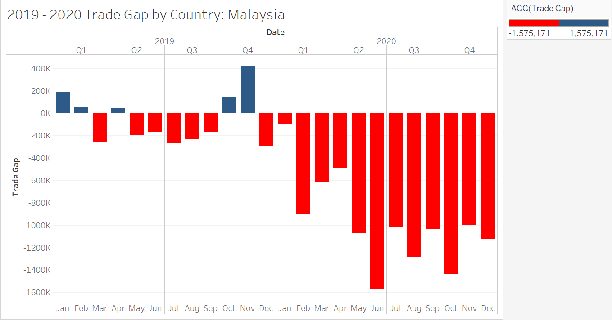
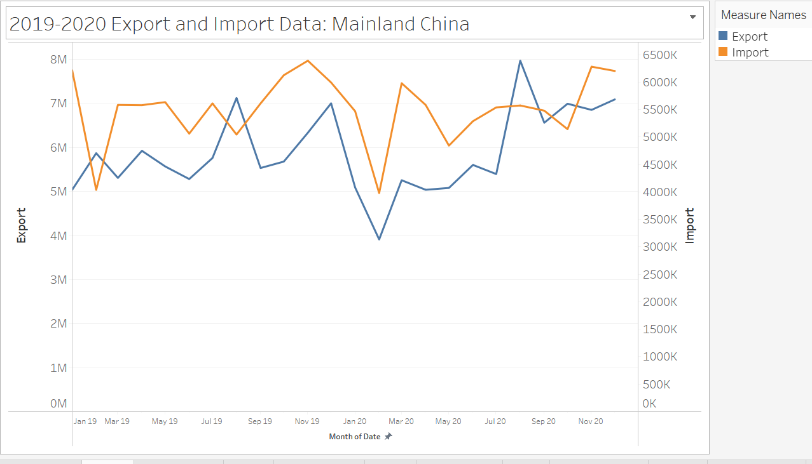
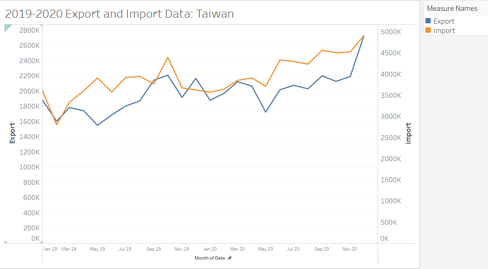

```{r setup, include=FALSE}
knitr::opts_chunk$set(echo = FALSE)
```

# The Task

### 1. Critic the graph from both its clarity and aesthetics. At least three from each evaluation criterion.


**Clarity**

a) Overall visualization does not depict if the export is more than the import 
or if the import is more than the export.
Visually, we can only see colours patch and not much information. A bar chart / 
even a time series would have depicted this information better.

b) Even though the x-axis says monthly data, the data shown in the graph is 
yearly data. Since the raw data is for a period of 2 years (by monthly data), 
a time series chart would be more helpful to check the trend of imports/exports 
in the 2 years' period.
    
c) Given that the 6 countries' graphs are shown separately, there is no single 
graph presented to show if the overall numbers have a trend. A graph for all 6 
countries for exports and a graph for all 6 countries for imports would tell a
different story.
    
**Aesthetics**

a) The graphical representation does not have a clear marking by month even 
thought the y-axis says the data is month of period. We can make the graph 
bigger to cover the data for 24 months (2 years) to show the trend.

b) The colours in the graph are overlapping and there is no clear demarcation to
show the where the exports and imports exceed each other and under which 
month/year. This graph is visually not appealing.

c) While dual axis helps to differentiate the data between import and export values,
trade gap (export-import) data is required by economists to evaluate the difference 
and assess the gap.

### 2. With reference to the critics above, suggest alternative graphical presentation to improve the current design. The proposed alternative data visualisation must be in static form. Sketch out the proposed design. Support your design by describing the advantages or which part of the issue(s) your alternative design try to overcome.

I would propose to split the graph into 2 to show the time series between import and export.
At the same time, I would calculate a trade gap to show when the gap was positive and negative.

Sketch of the proposed design below:


The advantages of a **time series** chart is that:

a) It shows the trend over a course of time taking into account the highs and 
lows of both imports and exports.

b) The time clearly depicts the trend that the trade is following for a 
particular country.

The advantages of a **bar chart** for the trade gap data is:

a) Gap analysis may be easily identified to show the economists where there is 
a shortfall in export/import as this directly impacts the GDP.

b) The months whereby the trade gap was positive or negative is easily visualized 
without any further calculations.

### 3. Using Tableau, design the proposed data visualization. 

Please view the proposed data visualization in Tableau Public [**here**](https://public.tableau.com/app/profile/amrita.mishra/viz/DataViz_1_May2021/TradeDashboard).


### 4.Provide step-by-step description on how the data visualization was prepared.

#### Data Download:
Download the data from here [https://www.singstat.gov.sg/find-data/search-by-theme/trade-and-investment/merchandise-trade/latest-data] under region/market section.

The output consists of data across all countries for many years prior to 2021.

#### Data Cleansing:
Using the output file, we will do basic data filtering to use only the relevant data. We are only interested to review the data of countries - Mainland China, HongKong, Taiwan, Japan, Malaysia and United States. 

We will filter the 6 countries' data and add it to a sheet labeled as "Combine". The data is transposed in order to plot a time series easily. The data is further filtered to show only Jan 2019 to Dec 2020 data.All the countries' data is added one after the other. We will only use the columns - Date, Import, Export, Country.

Metadata Information:
Date - Month and year of data
Import - Import Value of the country
Export - Export value of the country
Country - To which country the value belongs to


#### Data Import to Tableau:
We will open Tableau 2021.1 version of desktop app. We will import the revised excel file "OutputFile_V1".
We will change the data type of Month/Year to "Date" type.


#### Data Visualisation Preparation for Static Graphs:

We will go to our first worksheet which has the attributes on the left. Our goal is to prepare a remodeled graph for each of the 6 countries in a static form.

We will build a trade gap graph and an import/export graph for the 6 countries.

Building the Trade Gap graph:

**Step1**
We need to derive a new field called Trade Gap. This is the difference between Export and Import values.
We will use the "Create Quick Calculation" method to add the formula for trade gap and then a new attribute wil appear under "measure".


**Step2**
We will use the "Create calculated Field" to derive 2 new attributes: "Negative Trade Value" and "Positive Trade value". These are just +/- numbers based on the trade gap formula. 


**Step3**
Add the country to the filter tab. We will use the filter to build a static dashboard for the respective country.
For the 1st dashboard, filter the country.

For columns, add the Date by year, quarter and month.
For Rows, we will add the Trade Gap.


**Step4**
We will review the marks pane and perform the necessary changes to reflect the data correctly.
Trade Gap would be dragged to "Colour".
Negative and Positive values will be added to "Details".
Overall structure will be changed to "Bar" to represent a bar graph.


**Step5**
For the X-axis, change the range to fix it between 1/1/2019 and 31/12/2020.
Change the name of the axis to Month/Year.
The tick interval is set at 1 month.


**Step6**
It is important to standardise the colour of the graph.
We will use the Edit colour feature on the right side to make the changes.
Red indicates negative trade value.
Blue indicates a positive value.


**Step7**
Edit the Worksheet title by double clicking on the title and editing the data in the edit title pane.
Reflect the country by inserting the country sheet from the "Insert" function.


**Step8**
CLick on the tool tip attribute to make further enhancements to our visual.


**Step9**
The trade gap graph is now ready. Repeat this for all 6 countries to get the final trade gap graphs.





Building the country wise import/export values' time series graph.

**Step1**
Add the Month/Year under Column and Export / Import under Rows.


**Step2**
Change the worksheet title to reflect the country by inserting the country sheet from the "Insert" function.


**Step3**
Use the Mark Pane to make the changes to export and import lines.
Export line is blue.
Import line is orange.
The type of the graph is line graph. The size is increased to define the density.


**Step4**
You would notice that the export is on the y-axis on the left and import is on the
y-axis on the right. 


**Step5**
For the X-axis, change the range to fix it between 1/1/2019 and 31/12/2020.
Change the name of the axis to Month/Year.
The tick interval is set at 1 month.


**Step6**
For the y-axis, we may choose to shorten the graph by fixing the axis between 2 points.
This value will vary between countries because some have long range while some have a short range starting only 300K.
Since the final graph would be plotted on a single axis, we refrain from adjusting the y-axis values.

**Step7**
The 1st time series graph is now ready. We repeat this for the 6 countries.
Final output is shown below.








### 5.The final graphs of the 6 countries combined.
It is important to notice how visuals can change our assumption without looking at the data carefully.
We will use the dashboard feature to combine the data and plot 2 graphs. It is essential to plot the 2 graphs separately as they are telling a different story.

1 is a graph of import/export for the 6 countries.
1 is a trade gap graph for the 6 countries.
Both the graphs are depicted for 2 years.

**Step1**
We will open a new worksheet.This will be to compare the trade gap of the 6 countries in a single snapshot.

**Step2**
We will add the Date under column and Trade Gap under rows.

**Step3**
We will use the marks pane to add visual attributes to our graph.
COuntries will be dragged to colours.
Positive and Negative trade values will be dragged to details.

**Step4**
Edit the X-axis to represent the right range of data.

**Step5**
Edit the sheet title to show "2019-2020 Trade Gap Comparison by Countries".

**Step6**
Right click on the y-axis to add a reference line.
We will fix it at the constant 0 to differentiate the positive and negative values.

Final Graph is ready as below.


**Step7**
We will open a new worksheet.This will be to compare the import/export of the 6 countries in a single snapshot.

**Step8**
We will add the Country, Year and Measure Names under column and Measure Values under rows.
This step is important because we are trying to compare 2 measures - import and export against the 6 countries.

**Step9**
We will use the marks pane to add visual attributes to our graph.
Measure Values will be added to the colour pane to show different colour for import and export.

**Step10**
Edit the X-axis to represent the right range of data.Since we are showing 6 countries' data for 2 years, we will increase the ticker size to 1year to show only the yearly data.
This is to ensure the graph looks neat and yet represents the correct information for the economists to evaluate.

**Step11**
Edit the sheet title to show "2019-2020 Export/Import Data".
Final Graph is ready as below.


**The Final Dashboard**
Using the dashboard feature, we will drag the 2 consolidated worksheets to the layout pane.
In a single view, we can see the performance of import/export per country for the 2 years.
At the same time, the graph below would show the countries where the trade gap is positive or negative.


### 6. Describe three major observations revealed by the data visualisation prepared.
The benefits of a time series chart is that, it shows us a clear trend, gap and possible direction of the numbers.
Benefits of the bar chart is that - it shows a clear demarcation of the data.

**a) Export:**
- The export value of Mainland China declined sharply from Dec 2019 to Feb 2020. Then, it gradually increased. The absolute values of export are highest for Mainland China from Aug 2020 to Dec 2020.Looking at the overall 2019-2020 numbers, Mainland China had the highest export values. 
- The absolute export numbers are second highest for Hong Kong for 2019-2020.
- The export values of United States is declining since Aug 2020.

**b) Import:**
- The import values of Hong Kong is the lowest, consistently for the 2 years.
- It is interesting to see that China retains the highest import values in absolute terms given the size of the country.However, the exports are higher ensuring a positive trade gap.
- Taiwan has higher import values than export values throughout 2019-2020 suggesting that Taiwan imports most of the goods into the country but does not export much.

**c) Gap Analysis:**
- Gap analysis reveals that Hong Kong has the highest positive trade balance. The exports have been
higher than imports for the years 2019-2020.
- Taiwan has the highest negative trade balance. Taiwan has high imports and the value of exports has
not exceeded its import in 2019 and 2020.


**Key Links**

a) Github: https://github.com/Amrita83
b) Netlify:https://amritamishra.netlify.app/
c) Tableau:https://public.tableau.com/app/profile/amrita.mishra/viz/DataViz_1_May2021/TradeDashboard


Distill is a publication format for scientific and technical writing, native to the web.

Learn more about using Distill at <https://rstudio.github.io/distill>.


