```{r setup, include=FALSE}
knitr::opts_chunk$set(echo = FALSE)
```

# The Task

### 1. Critic the graph from both its clarity and aesthetics. At least three from each evaluation criterion.

Source: [**Department of Statistics, Singapore**](https://www.singstat.gov.sg/modules/infographics/singapore-international-trade)

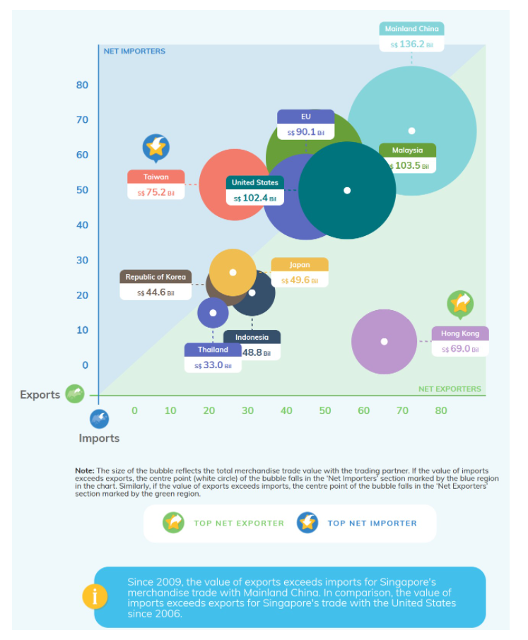

Intent of Graphical Representation:
Provide Visual representation of Exports (Y-axis) and Imports (X-axis) i.e., Exports Vs Imports Value for multiple markets with respect to Singapore.

Data Inputs for producing visual representation is as follows:
Input 1:Market
Input 2:Imports
Input 3:Exports

Possible inferences include (Business values for each market in terms of Imports ($ Value) Vs Export ($Value)

**Clarity**

a) Overall basic visual representation of data is unclear. It is unclear if the size of the bubble represents the size of the trade since the size of the bubble is relative to one another. 

b) Adding a white dot to the import/export region to represent net trade value is very unclear and does not indicate a trade surplus/deficit visually.

c) Since each market is represented by a colour and there are many overlaps, it is unclear how a market is performing.

d) Dollar value represented on the graph seems to be total business value of import + export. Since only the overall trade value is represented on graph, it does not show a visual split of the import and export values.

e) The X-axis and Y-axis are misleading with no unit numbers or axis details mentioned. As a reader, I do not know whether the 80 means 80million, 80% or what attribute.

f) The graph seems static and we do not know for which period was the graph made. Ideally, a graph should show the trend if it is supposed to reflect growth. If the graph is indicative of trade for a particular year, the year details should be mentioned clearly.

**Aesthetics**

a) Color coding for Thailand and EU seem very similar, including the labeling and the bubble representation. The colours could be made different (if a colour is absolutely needed).

b) The United States label seems to point to some data in the graph but visualization is unclear.
Similar issues exists for Malaysia.

c) Bucketing / summing up the total trade value for both imports and exports does not represent the true trade affair of the country. It would be easier to show each country separately for a deep dive analysis of the import/export analysis. Alternatively, a trend line may be used to show the growth of trade (import/export) over the years to reflect the true nature of Singapore's trade with its trading partners.

-----------------------------------------------------------------------------------------------------------------

### 2. With reference to the critics above, suggest alternative graphical presentation to improve the current design. Sketch out the proposed design. The proposed alternative design should include appropriate interactive techniques. Support your design by describing the advantages or which part of the issue(s) your alternative design try to overcome.

Intent of Data Visualization can be better visualized by plotting using line graphs with different color coding of Nations/Countries and Dollar Values for Imports and Exports separately for each country. Final representation must enable Business User to identify Dollar Values of Each Country/Nation for their Import Vs Export to determine the nett trade.

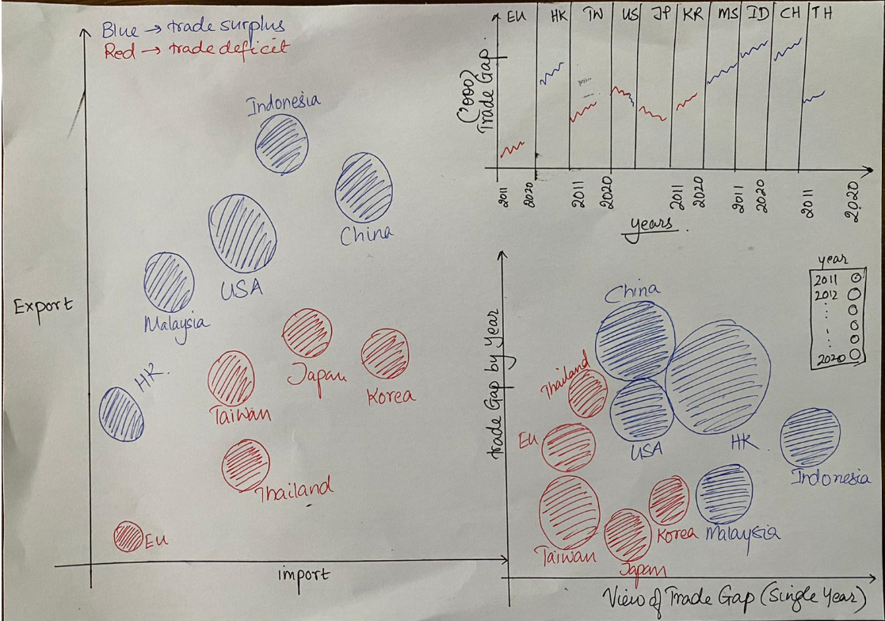

----------------------------------------------------------------------------------------------------------------

### 3. Using Tableau, design the proposed data visualization. 

Please view the proposed data visualization in Tableau Public [**here**](https://public.tableau.com/app/profile/amrita.mishra/viz/Tableau_DataViz2/TradeDashboard)

----------------------------------------------------------------------------------------------------------------

### 4.Provide step-by-step description on how the data visualization was prepared.

#### Data Download:
Download the data from here [https://www.singstat.gov.sg/find-data/search-by-theme/trade-and-investment/merchandise-trade/latest-data] under region/market section.

The output consists of data across all countries for many years prior to 2021.

#### Data Cleansing:

Metadata Information:
Date - Month and year of data
Import - Import Value of the country
Export - Export value of the country
Country - To which market the value belongs to

* Once the data is extracted, we will filter out the 10 markets' data along with the import/export values for 2011Jan -2020 Dec. 
* This step can also be carried out in Tableau by importing the 2 excel tabs T1 and T2, joining them together. 
* After which, a formula can be added to join the records from T1 = T2.
* Once the records are joined, we review the data type and convert all the import and export values to "Numeric" and check on the "Month/Year" data type to Date format.

Our cleansing part is now done and we can use the worksheet tab to tabulate our interactive charts. For Data Visualisation, it is seldom possible to add all the information in a single chart especially when there are multiple variables, markets and 10 years worth of data to view.

This is where an interactive charts become useful in providing us an overview and also a method to view singular data if we want.

#### Tableau Preparation

**Chart 1: Performance by Country**
Our 1st chart is to perform interactive chart by market for the 10years for import and export data.

1. We drag the countries attribute to "Filters" section. Ensure to select only the 10 required countries that we need.
2. We drag Year to Columns and Sum(Export) & Sum(Import) to Rows.
3. Under the marks pane, we select the graph as line.
4. We drag the measure names to colour pane.
5. Check if both Export and Import panes are reflecting the above configuration.
6. We need to synchronise the axis to reflect the correct data.
7. We edit the countries' filter by adding "Show Filter". This will populate a chart on the right which allows us to click multiple values. We are only interested in seeing the deep dived data for a single market. Hence, we will change the show filter to a single radio button.
8. Our market wise interactive chart is ready to see how each of the market performed in the last 10 years.


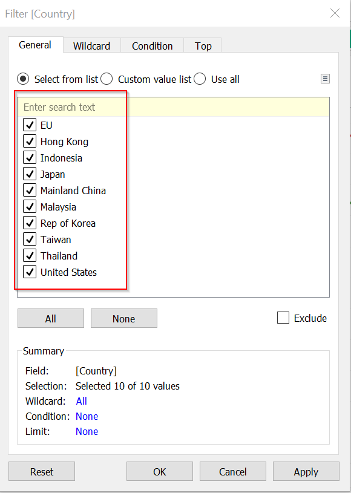
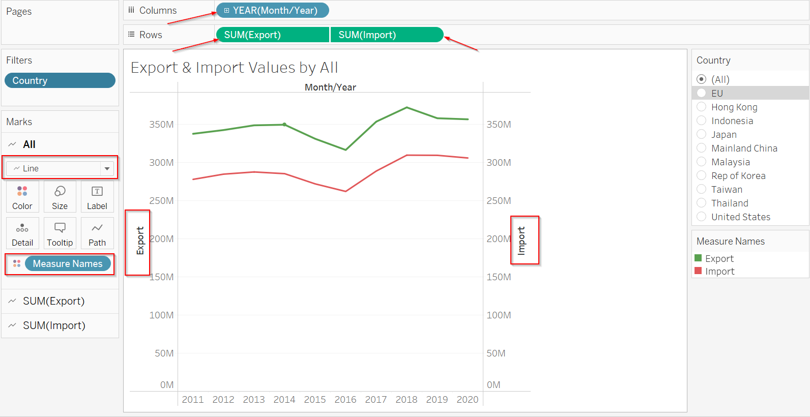
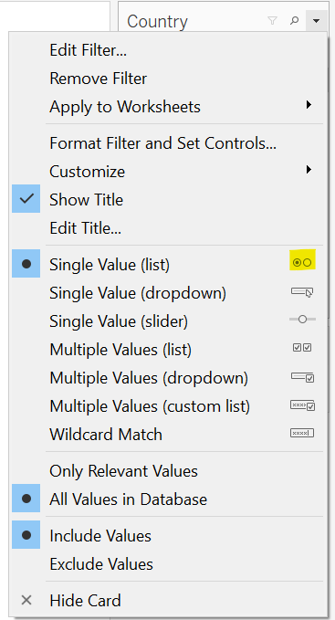
**Chart 2: Trade Gap by Year**
For the 2nd chart, we will check how the trade gap perform for each of the 10 markets by the years.
Since we want to see all the 10 countries together, we will apply a year wise filter.

1. Drag the year attribute to filter pane. Ensure you select only 2011 Jan to 2020 Dec data.
2. We need to calculate Trade Gap which is the Sum(Export)-Sum(Import). We will use the formula under Analysis to create this new calculated attribute.
3. Our target is to make a bubble chart to show all the markets by year. The bubbles will be coloured based on their deficit type. If export is > import, then trade deficit is positive and will be green. If trade deficit is negative, the colour will be red. It is worth knowing that the deficit with a market is from Singapore perspective only.It does not mean that the respective market has a trade deficit.
4. We shall drag the Trade Gap attribute to Size, then again to colour. We shall add the Country to Details.
5. Using the Filter attribute, we will "Show Filter" for the years. A multi select chart will open up. We will change it to single value radio button.
6. Under the colours, we will edit the colours to reflect red and green and only 2 solid colours with mid-point being 0.

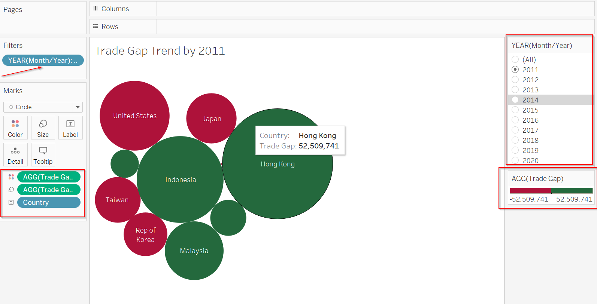

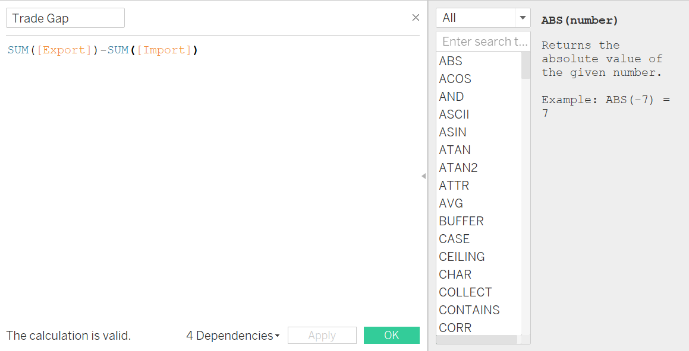

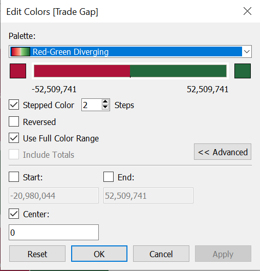

**Chart 3: Trade Gap by Analysis - Single Dashboard**
A single dashboard view would certainly tell us how each country performed in relation to one another within the period of 10 years. It is indeed tough to consolidate a single view without compromising on the overall data analysis.

1. We will use the attribute calculated earlier - Trade Grap to perform the analysis here.
2. Drag country and year to the filter pane. We need to use these 2 attributes to filter out information later.
3. Drag the country and year to the column tab. Drag the Trade Gap to the row tab.
4. Add the Trade Gap to the colour pane.
5. Change the type of graph to Line graph.
6. Use the show filter attribute for both country and year. Then select the single value radio button.
7. Ensure the Trade Gap colour is dual solid colour - red and blue only with 0 as mid axis point.
8. The toop tip is important to show the correct data as we hover the cursor to various points. Once the tooltip is activated, the trade gap value will be shown in the graph.

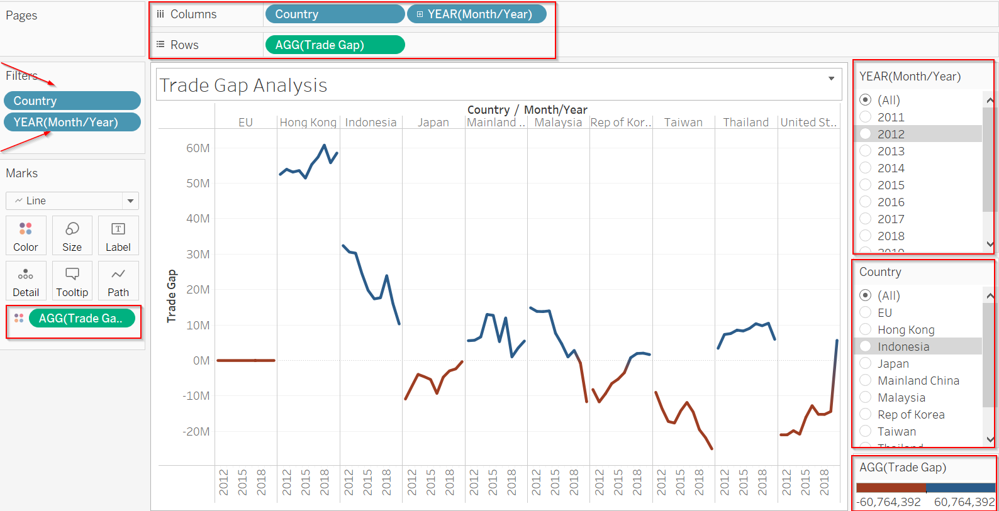

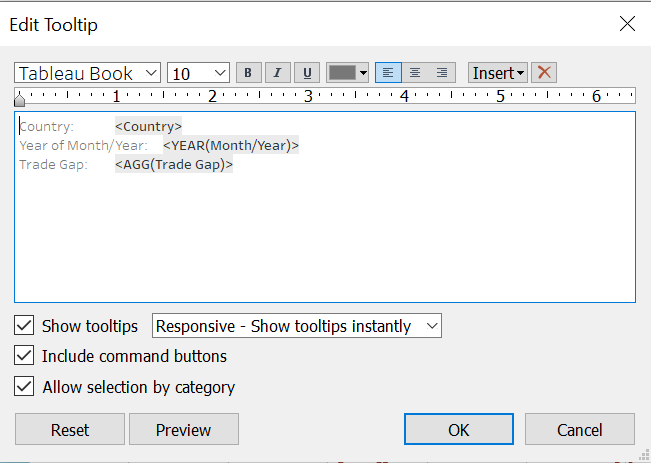

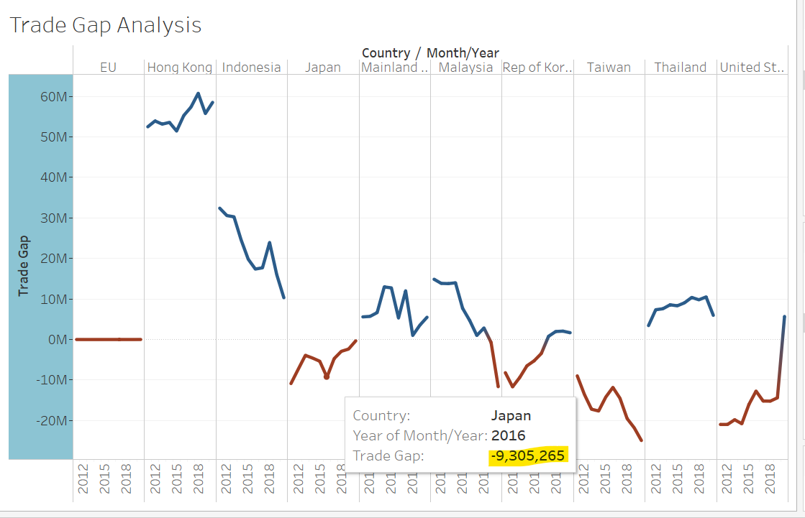

**Chart 4: Trade Summary by Country for 2011-2020**
Since our original chart was a bubble type, we wil try and recreate a similar chart making it neater and more interactive. The above charts are helpful to us in determining what comprises of the trade data in the last 10 years with different views.

1. Drag country and year to the filter pane. We need to use these 2 attributes to filter out information later.
2. Drag the Sum(Export) to rows and sum(Import) to Columns of the graph builder.
3. Use the Marks pane to add Trade Gap to Colour, Trade Gap again to Tooltip, Country to Size, Country again to Label. 
4. Use the show filter attribute to show the country and years on right side. For Countries, we will retain the multiple filter. For Years, we will retain the single value radio button. Thsi is because we want to see only 1 year at a time but for all / many countries together. This would look like a nice interactive scaatter plot.
5. Using the edit colour function, we will change the colour to 2 solid tone with a mid value axis at 0. 
6. When you change the year, you would see the bubbles move. It would show on a particular year, what was the trade gap (surplus/deficit). Blue indicates surplus. Red indicates deficit.


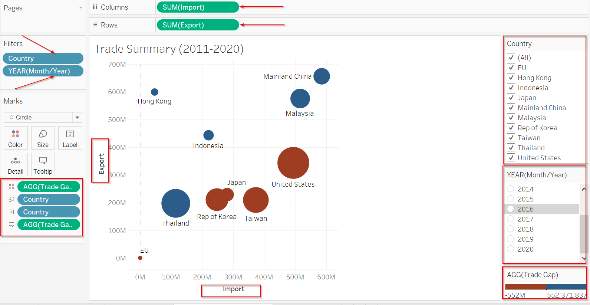

#### The Final Dashbaord

We have prepared an interactive dashboard that retains the original design and also clearly highlights the import/export data of the 10 markets by years 2011-2020. The dashboard is interactive with radio buttons which allow the user to deep dive to a particular year to see the data. We drag the Chart 4 to our dashboard panel to prepare the interactive dashboard. This dashboard is saved in Tableau Public for data enthusiasts to view.

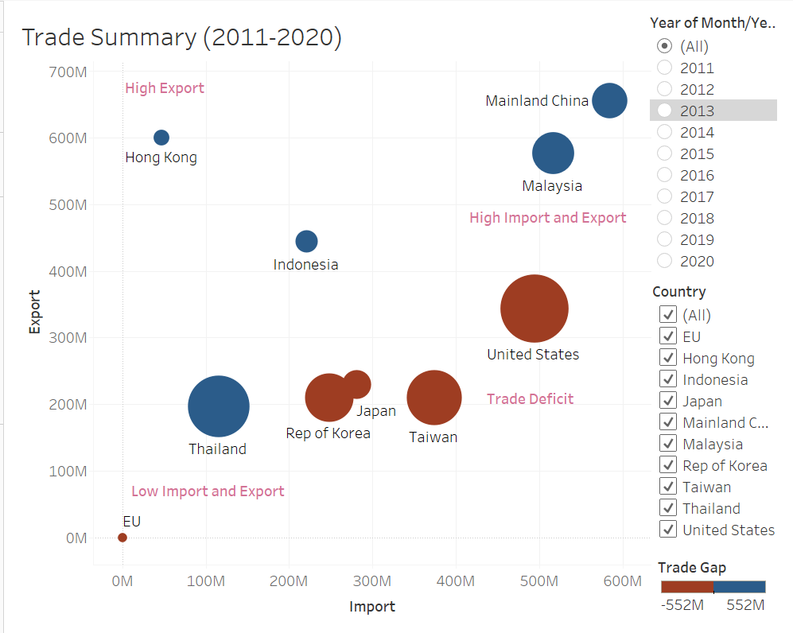

----------------------------------------------------------------------------------------------------------------

### 5. Describe three major observations revealed by the data visualisation prepared.

**Taiwan**: The import of Taiwan has been higher than exports consistently since 2011-2020. There was an import dip in the year 2016 but effective 2017, the import went up. It has the highest import in comparison to the remaining 9 markets.

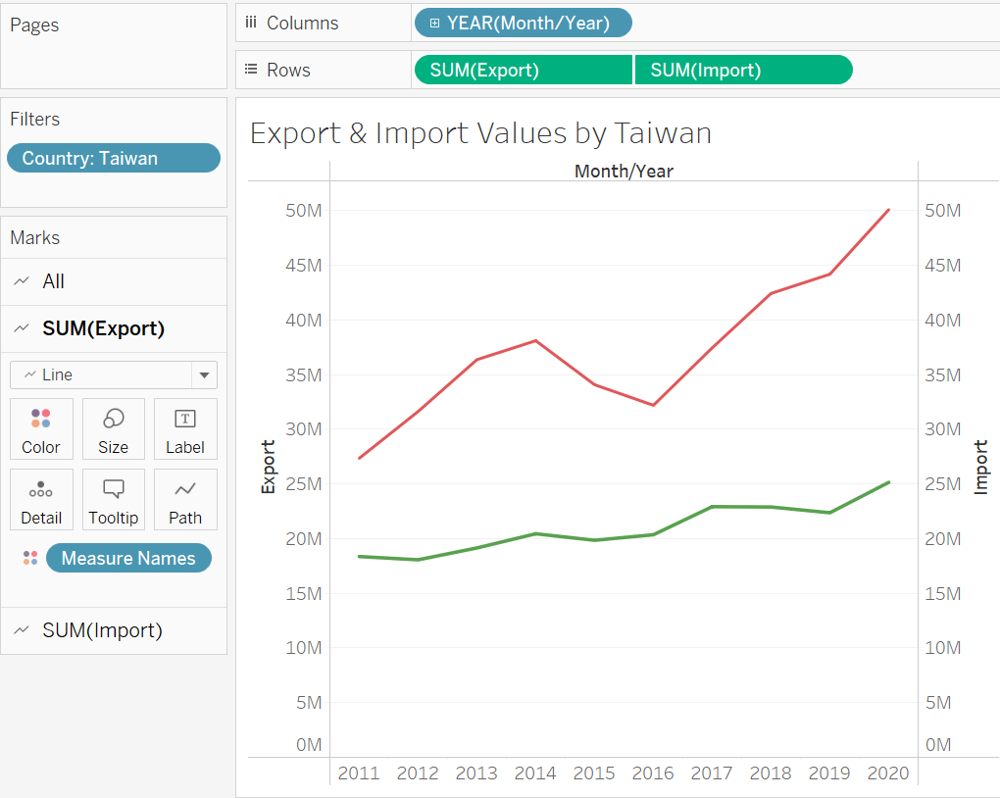

**Hong Kong**: In contrast, Hong Kong has the highest export values consistently since 2011-2020.The values once reached 65.7M in 2018 (the highest export values recorded when compared to other markets). It is interesting to note that COVID has no impact on trade for this market.

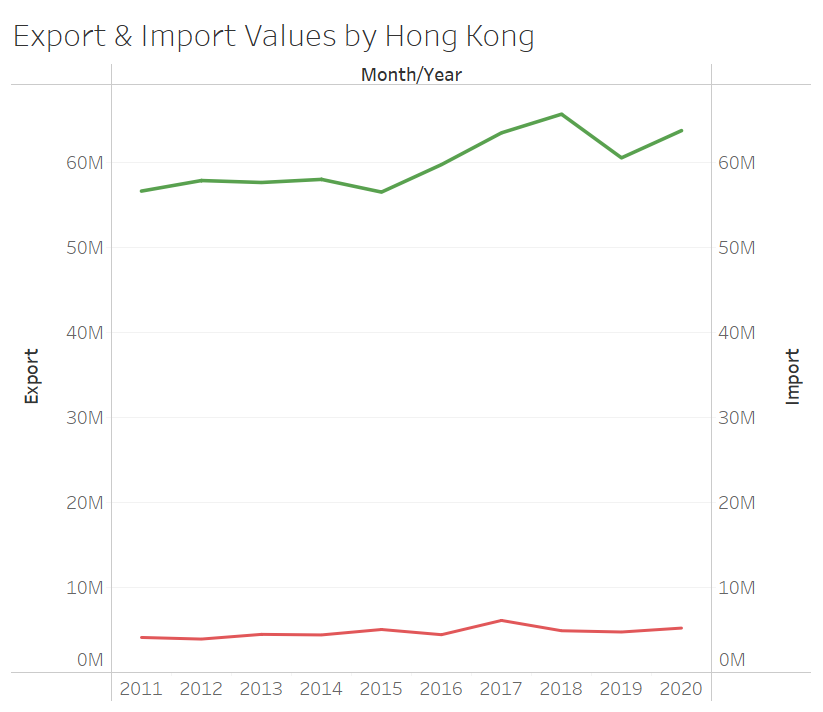

**Mainland China**: As per the original graph, it looks like Mainland China has the highest import and export values. While the absolute values of import and export is indeed the highest, the trade gap between export and import is not high for Mainland China.It is interesting to note that other countries like Indonesia and Malaysia have a higher or equal trade gap suggesting that Singapore probably imports more from Indonesia and Malaysia than exports to them. Whereas, Singapore's import/export values with China is on par. After 2019, the import values seem to decline possibly owing to COVID reasons

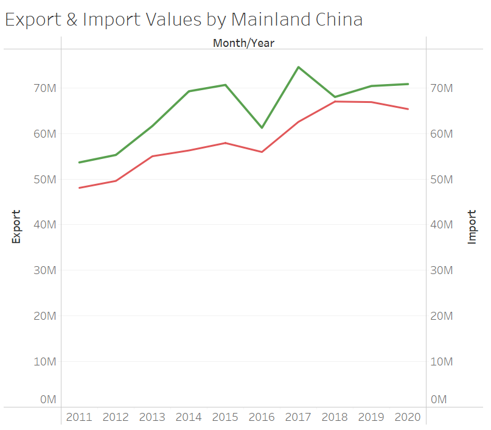

**United States**: It is interesting to see that United States does not have large import / export values or a large trade gap. However, since Covid started, Singapore exported a lot of goods out to the US. Since mid-2020, the export values have overtaken the import values.The trade gap has shrunk over the last 10years while the overall trade exports have grown.

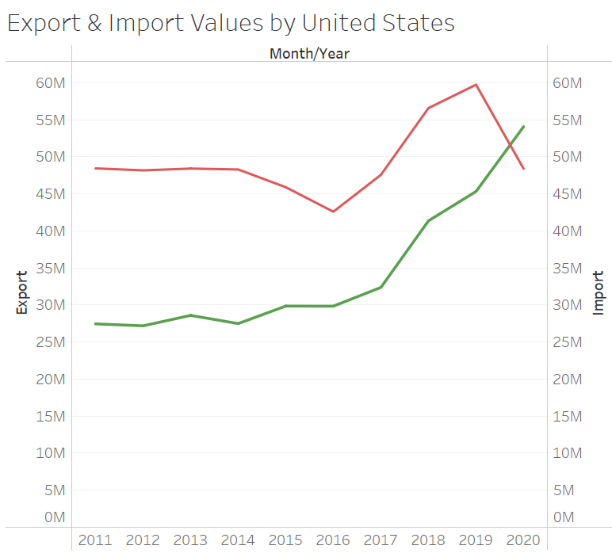

**Malaysia**: Since the onset of COVID, trade with Malaysia has entered into a deficit. This is possible due to many household goods which are imported from Malaysia. There is constantly a rising demand of household goods in Singapore due to circuit breaker / restrictions of travelling out of the country. Demand of groceries and eatables have gone up.

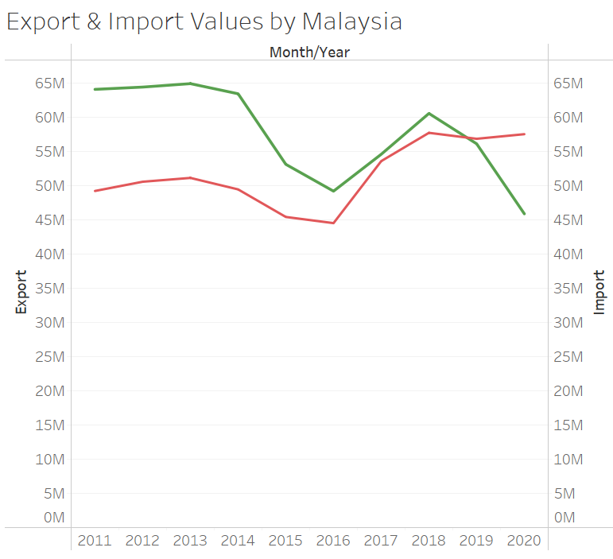

**EU**: While EU is actually large and comprises of many countries, the trade with EU is the lowest, hovering around 30-60K ('000) only.This indicates that Singapore may have its own favourities for trading and mostly the neighbouring countries are prominent trading partners.

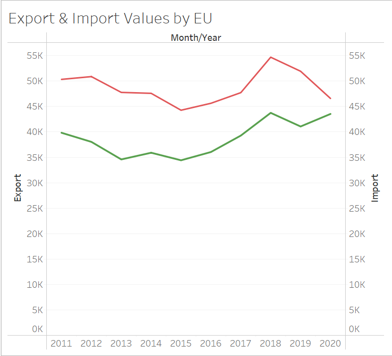

*Trading Partners*: In the last 10 years, Mainland China and Malaysia have remained as the top 2 trading partners of Singapore. It is interesting to see that the trading volume has indeed increased over the last 10years to cater to the growing demands of the increasing population.
What would be interesting to note is the type of merchandise that is traded by these markets and the specific trends in the last 10years. 
Due to COVID, many trading partners experienced uncertain times and hence possibly erratic volumes. We may want to perform additional analysis to check how the market trend will be in the post-COVID world.

Key Links

Github: https://github.com/Amrita83
Netlify:https://amritamishradatablog.netlify.app/posts/2021-06-20-dataviz2/
Tableau:https://public.tableau.com/app/profile/amrita.mishra/viz/Tableau_DataViz2/TradeDashboard


Distill is a publication format for scientific and technical writing, native to the web.

Learn more about using Distill at <https://rstudio.github.io/distill>.


