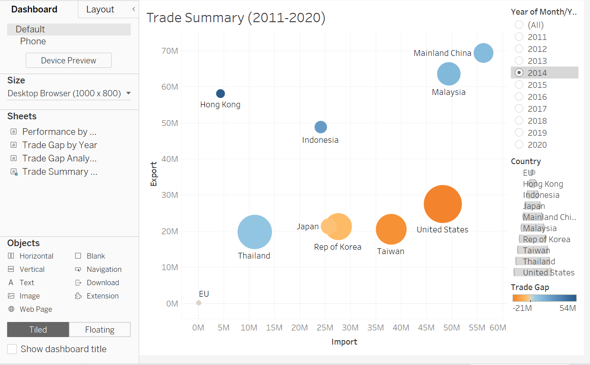

```{r setup, include=FALSE}
knitr::opts_chunk$set(echo = FALSE)
```

# The Task

### 1. Critic the graph from both its clarity and aesthetics. At least three from each evaluation criterion.

Source: [**Department of Statistics, Singapore**](https://www.singstat.gov.sg/modules/infographics/singapore-international-trade)


Intent of Graphical Representation:
Provide Visual representation of Exports (Y-axis) and Imports (X-axis) i.e., Exports Vs Imports Value for multiple markets with respect to Singapore.

Data Inputs for producing visual representation is as follows:
Input 1:Market
Input 2:Imports
Input 3:Exports

Possible inferences include (Business values for each market in terms of Imports ($ Value) Vs Export ($Value)

----------------------------------------------------------------------------------------------------------------

**Clarity**

a) Overall basic visual representation of data is unclear. It is unclear if the size of the bubble represents the size of the trade since the size of the bubble is relative to one another. 

b) Adding a white dot to the import/export region to represent net trade value is very unclear and does not indicate a trade surplus/deficit visually.

c) Since each market is represented by a colour and there are many overlaps, it is unclear how a market is performing.

d) Dollar value represented on the graph seems to be total business value of import + export. Since only the overall trade value is represented on graph, it does not show a visual split of the import and export values.

e) The X-axis and Y-axis are misleading with no unit numbers or axis details mentioned. As a reader, I do not know whether the 80 means 80million, 80% or what attribute.

f) The graph seems static and we do not know for which period was the graph made. Ideally, a graph should show the trend if it is supposed to reflect growth. If the graph is indicative of trade for a particular year, the year details should be mentioned clearly.

----------------------------------------------------------------------------------------------------------------  
**Aesthetics**

a) Color coding for Thailand and EU seem very similar, including the labeling and the bubble representation. The colours could be made different (if a colour is absolutely needed).

b) The United States label seems to point to some data in the graph but visualization is unclear.
Similar issues exists for Malaysia

c) Bucketing / summing up the total trade value for both imports and exports does not represent the true trade affair of the country. It would be easier to show each country separately for a deep dive analysis of the import/export analysis. Alternatively, a trend line may be used to show the growth of trade (import/export) over the years to reflect the true nature of Singapore's trade with its trading partners.

-----------------------------------------------------------------------------------------------------------------

### 2. With reference to the critics above, suggest alternative graphical presentation to improve the current design. Sketch out the proposed design. The proposed alternative design should include appropriate interactive techniques. Support your design by describing the advantages or which part of the issue(s) your alternative design try to overcome.

Intent of Data Visualization can be better visualized by plotting using line graphs with different color coding of Nations/Countries and Dollar Values for Imports and Exports separately for each country. Final representation must enable Business User to identify Dollar Values of Each Country/Nation for their Import Vs Export to determine the nett trade.


### 3. Using Tableau, design the proposed data visualization. 

Please view the proposed data visualization in Tableau Public [**here**]

### 4.Provide step-by-step description on how the data visualization was prepared.

#### Data Download:
Download the data from here [https://www.singstat.gov.sg/find-data/search-by-theme/trade-and-investment/merchandise-trade/latest-data] under region/market section.

The output consists of data across all countries for many years prior to 2021.



#### Data Cleansing:

Metadata Information:
Date - Month and year of data
Import - Import Value of the country
Export - Export value of the country
Country - To which country the value belongs to

### 5. Describe three major observations revealed by the data visualisation prepared.
Observation 1


Distill is a publication format for scientific and technical writing, native to the web.

Learn more about using Distill at <https://rstudio.github.io/distill>.


