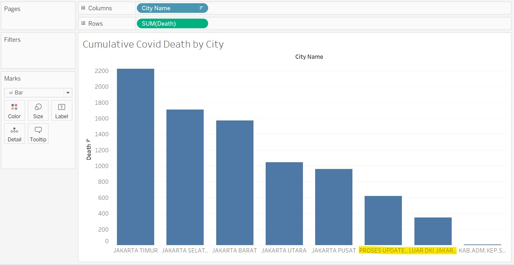
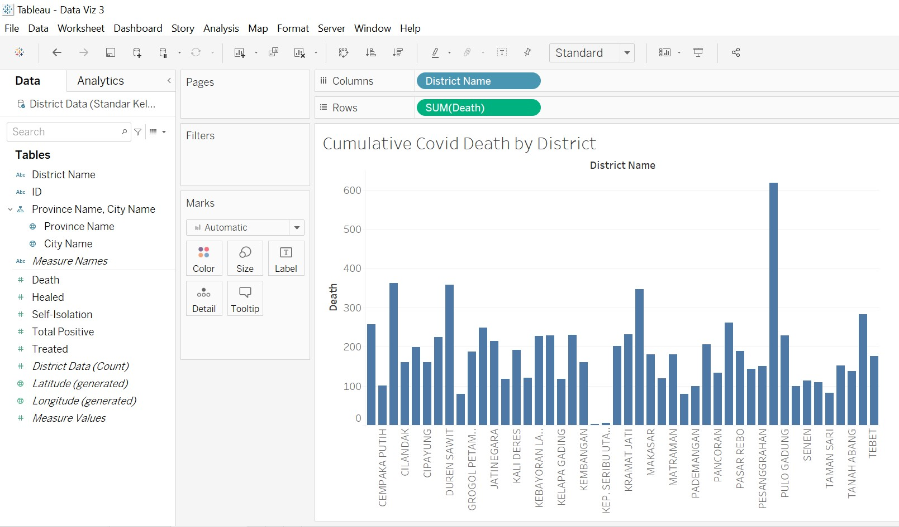
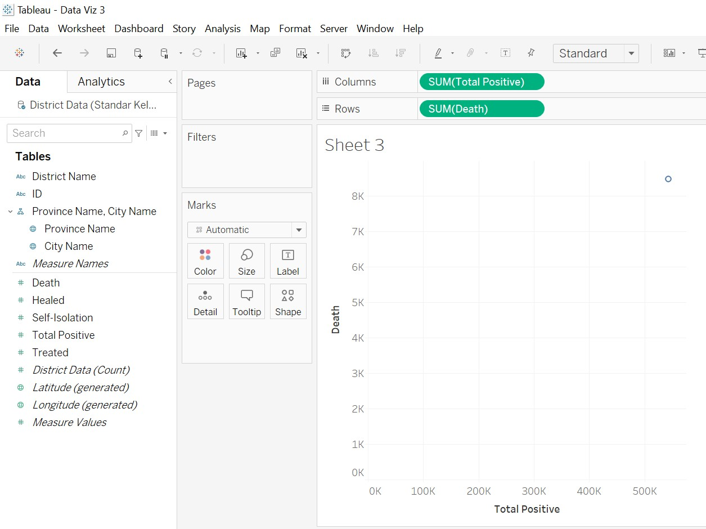
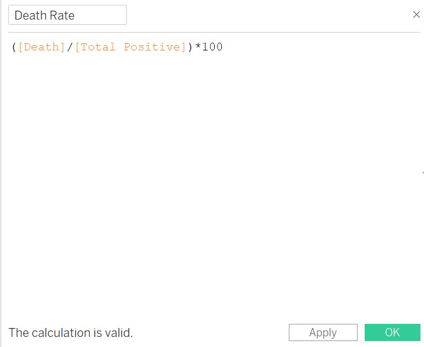
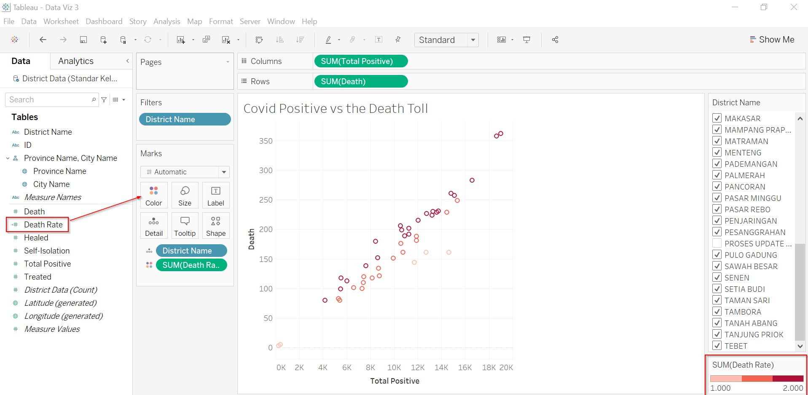
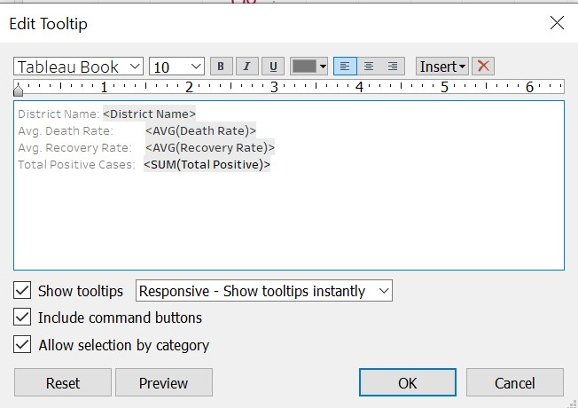
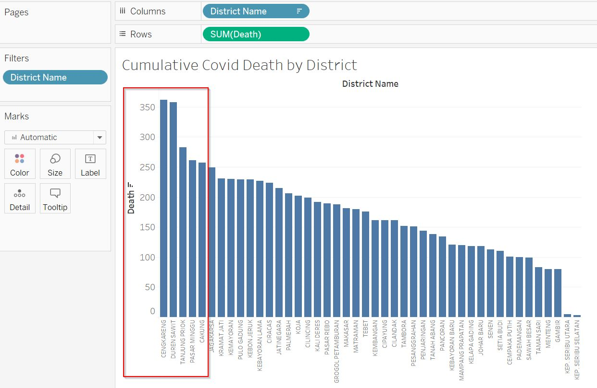

```{r setup, include=FALSE}
knitr::opts_chunk$set(echo = FALSE)
```

# The Scene

A data journalist is tasked to prepare two data visualization to support the news write-up of the latest development in DKI Jakarta. Below are the two data visualization prepared by the data journalist.


# About the Data


There are 2 data sheets in the excel. Looking at the data sheet, we notice that the data sheet is labeled in Bahasa Indonesia. 

1. Tab 1 is a district wise data (nama_kota) which is bifurcated by village name (nama_kelurahan).

2. Tab 2 is aggregated district wise data. 

3. For easy reference and understanding, we will translate the key words into English (only for data which is available by each district).

4. There are columns with no data by district. We will not use these columns for our analysis.

5. There is an entry on Proces Update Data and Luar DKI Jakarta which does not sound like a city / district name. We will not retain them in our analysis as we do not know what this means. They seem lke an aggregated data.

6. Population data is not provided making it difficult for us to compare if the covid cases and death toll is in line with the population figures.

____________________________________________________________________________________________________________________

# The Task

## 1. Critic the data visualisation from both its clarity and aesthetics. At least three from each evaluation criterion

**Clarity**

1) The chart is quite cluttered due to multiple districts shown. The entire data set is huge and hence a plot chart loses focus on what it is trying to show. It would be easier to use a plot chart to represent only the top 5 district and not the entire data set.

....................................................................................................................

2) The comparison of the data for dots which are closer to each other is difficult to compare and analyse.This is because they appear very close and hence, the difference is not easily visualized.

....................................................................................................................

3) The bar graph should be scaled to show the numbers starting from 1000 as the entire chart looks too big given the large values. That would easily showcase the differences in numbers. Considering that the total number of Cities are just 8, showing top 5 is of no use. It would be good to compare all 8 of them (including the proces update data).

....................................................................................................................

4) The average number of cumulative deaths in the bar graph is a misleading number - It is either an average or a cumulative, not sure what does an average cumulative figure represents.If we are comparing total death toll, the bar graph should just show a cumulative number and not an average.

....................................................................................................................

**Aesthetics**

1) The plot chart can be changed to reflect a more interactive model - perhaps a bubble chart which would have the name added as a tooltip instead of the names hard-coded in the graph as above. This makes the graph look untidy with names not very easy to read.

....................................................................................................................

2) The plot chart can show the X-axis as the names vs Y-axis as the cumulative deaths in descending order to give a cleaner look. The label of the graph says top 5 district but the entire set of data is shown here. However, it would be ideal to compare the death numbers to positive cases to visualize the ratio. While the death number of Utara may be 1900, it would be good to know the total number of positive cases to compare if the rate itself is high.

....................................................................................................................

3) The bar chart can also have the X-axis as the names vs y-axis as the cumulative deaths for the top 5 districts.The cumulative number of deaths is an addition of the previous days, weeks, months counts. A vertical chart would be more appropriate in addressing the gravity of the situation.

____________________________________________________________________________________________________________________
## 2. With reference to the critics above, suggest alternative graphical presentation to improve the current design. Sketch out the proposed design. The proposed alternative design should include interactive techniques. Support your design by describing the advantages or which part of the issue(s) your alternative design try to overcome.

A Bar chart would help if we need to consider the different types of Covid positive cases along with their treatment, isolation, healed, and death categories. Since we are only keen to explore the death data vs total positive cases for the districts, we will explore 2 types of charts - a bar graph (showing positive cases vs death) and a line graph to show the total number of deaths. For the stacked bar graph, we will further use a % to calculate the death rate of the district.

If a daily data was provided, we could have built a line chart by each district (interactive in nature) to show the progress on a daily basis. Since the data provided is a snapshot of 30th June, we will stick to the data. And if a population data was provided, we would have calculated the rate of covid to check if the covid is widespread in a particular district.

The below is the proposed sketch of how I visualize the dashboard to look like.This would show which districts have the high death toll. Then proceed to compare them further on the basis of recovery and death rate (in proportion to total covid cases) to determine the fatality rate in a district.


____________________________________________________________________________________________________________________
## 3. Using Tableau, design the proposed data visualisation.

Please view the proposed data visualization in Tableau Public [**here**]()

The final dashboard looks like below.


____________________________________________________________________________________________________________________
## 4. Provide step-by-step description on how the data visualisation was prepared.

The data was extracted from Open Data Covid-19 Provinsi DKI Jakarta[**https://riwayat-file-covid-19-dki-jakarta-jakartagis.hub.arcgis.com**].

Based on the data cleansing done (refer to "About the Data" section), we prepared a final file which was uploaded to Tableau. Our cleansing part is now done and we can use the worksheet tab to tabulate our interactive charts. For Data Visualization, it is seldom possible to add all the information in a single chart especially when there are multiple variables, districts and a large data set to view.

This is where an interactive charts become useful in providing us an overview and also a method to view singular data if we want.

....................................................................................................................

**Chart 1 - Covid Death Toll by City**


1. To prepare the chart, we will drag the District Data worksheet as the data source.
2. Under the Sheet (renamed as Covid-City), we dragged the city names to Columns and Death data to rows.


3. The recommended bar chart is automatically formed.
4. We will use the descend button to sort the graph in descending order to show us which city has the highest Covid death toll.
5. Notice that the Death is a sum value indicating a cumulative number.



....................................................................................................................

**Chart 2 - Covid Death Toll by District**


1. Under the Sheet (renamed as Covid-District), we dragged the district names to Columns and Death data to rows.



2. The recommended bar chart is automatically formed.
3. We will use the descend button to sort the graph in descending order to show us which district has the highest Covid death toll.
4. Notice that the Death is a sum value indicating a cumulative number.
5. This graph would now show us the top 5 districts with highest covid deaths.
6. The district with highest covid deaths is labeled as "Proces Data Update". Since this is not a real district, we will exclude this data to see which are the next 5 districts with highest Covid death toll.
7. Similarly, we shall exclude LUAR DKI JAKARTA - which appears to be an aggregated number and not really a district representation.
8. In order to exclude a field, we ill right click on the graph and click on exclude. The value will be hidden from the graph.


....................................................................................................................

**Chart 3- Covid Death Toll by District: An Interactive Plot**


While is it interesting to know the highest death toll of covid positive people in the districts, it is more insightful if we can derive the death rate of the district.

1. In a new worksheet, we will drag and drop the covid positive cases to columns and death to rows.
2. Thereafter we will drag the district attribute to size pane.
3. We will exclude the "Process Update Data" and "Luar DKI Jakarta" by right clicking then selecting "exclude".This will normalize the graph by excluding the outliers.
4. We would need to calculate the "Death Rate" by "Creating a new calculation"
Formula is Death Rate / Covid Positive.
5. We will drag and add this attribute to the colour pane.
6. Under Death Rate, we will edit the colours to show the district with high death rate as bright red.
7. This is to show that even if the cumulative death number is high is a district, the death rate might be low indicating that the district does not really have a high rate of casualties of covid positive cases.
8. We have added a filter by district in case we want to drill down further and visualise the data by single/multiple districts.








....................................................................................................................

**Chart 4 - Covid Death Rate compared to Covid Recovery Rate by District: An Interactive Plot**


Since the data is a snapshot of 30th Jun 2021, a time series or a line graph will not be a representation of the data. Which is why we used a bar graph to visualise the cumulative numbers.
Additionally, an interactive bubble plot helped us visualise how a graph of death rate would look like and highlight any anomalies.

1. In a new worksheet, we will add a new calculation for recovery rate - (healed / covid positive) * 100
2. Drag the death rate to rows and recovery rate to columns.
3. Add district to filters and filter out Proces Update Data and Luar DKI Jakarta.
4. Add recovery rate to colour pane.
5. Add district name to size.
6. Add total positive cases to tooltip.
7. Edit the colour to reflect red and green only.
8. Add reference line to the x and y axis based on average values.
9. Reformat the axis to ensure only the range is reflected. This will normalize the graph and it will not look skewed.
10.Review the tooltip properties to edit as per below.
11. Final graph is ready.




____________________________________________________________________________________________________________________

## 5.Describe three major observations revealed by the data visualisation prepared.


1) Jakarta Utara is not the city with highest cumulative Covid deaths. It is Jakarta Timur.
The original representation has incorrect visualization. By making a new bar graph in descending order, we get a clarity as to which city has the highest Covid death cases.


....................................................................................................................

2) Based on the updated chart in descending order by district, we see that the top 5 districts have a death toll ranging from 362 to 257. The 5 districts are *CENGKARENG*, *DUREN SAWIT*, *TANJUNG PRIOK*, *PASAR MINGGU* and *CAKUNG*. This is again different from the original visualisation that reported DUREN SAWIT as the top district with Covid death. As per our graph, the district with highest death toll is CENKARENG.


....................................................................................................................

3) Our 3rd graph provides us with insight on which districts have the highest covid cases along with high death rate. It is important to know the total covid cases to know the actual death rate and the impact. The graph shows that *CENGKARENG*, *DUREN SAWIT* appear to have high covid cases and deaths. An appropriate analysis would have been with the population to compare. It is natural that a district with high population would record higher covid cases than a district with lower covid cases.


....................................................................................................................

4) Even though the absolute death numbers are high for the 5 districts listed above, the chart that compares recovery rate and death rate speaks another story. Based on the chart below, *KEP.SERIPU SELATAN* has the highest recovery rate and lowest death rate. 
On the other hand, *MATRAMAN* and *JOHAR BARU* have the highest death rate with recovery rate as one of the low ones.*TAMBORA* has the lowest recovery rate of all. Interestingly, none of the 3 districts featured in the journalist's visualization. 


A time series data and population data would have enhanced our overall visualization. Given the limitations in the data, this was the best we could prepare "For Your Eyes Only".


Distill is a publication format for scientific and technical writing, native to the web.

Learn more about using Distill at <https://rstudio.github.io/distill>.


