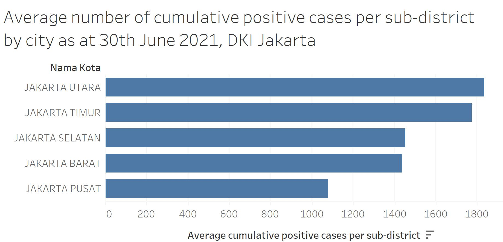

```{r setup, include=FALSE}
knitr::opts_chunk$set(echo = FALSE)
```

***The Scene***
A data journalist is tasked to prepare two data visualisation to support the news write-up of the latest development in DKI Jakarta. Below are the two data visualisation prepared by the data journalist.




#The Task#

###1. Critic the data visualisation from both its clarity and aesthetics. At least three from each evaluation criterion

**Clarity**


**Aesthetics**


###2. With reference to the critics above, suggest alternative graphical presentation to improve the current design. Sketch out the proposed design. The proposed alternative design should include interactive techniques. Support your design by describing the advantages or which part of the issue(s) your alternative design try to overcome.


###3. Using Tableau, design the proposed data visualisation.


###4. Provide step-by-step description on how the data visualisation was prepared.


###5, Describe three major observations revealed by the data visualisation prepared.


Distill is a publication format for scientific and technical writing, native to the web.

Learn more about using Distill at <https://rstudio.github.io/distill>.


